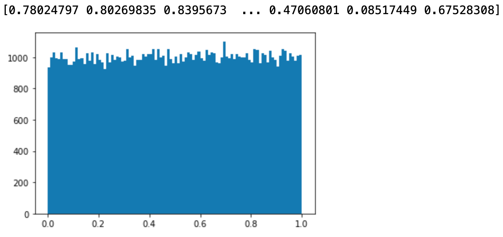

## Numpy 정리 day.1 ##

---

Numpy module을 사용하려면 당연히 모듈 설치부터 해야한다.

사용하고 있는 가상환경을 켜고 해당 가상환경에 모듈을 설치한다.

```bash
$ pip install numpy (일반)
$ conda install numpy (아나콘다 사용 시)
```

모듈 설치를 마치고 주피터 노트북에서 새 노트북을 생성한다.


### 1. ndarray 기초 ###

#### 1) ndarray의 특징 ####

ndarray는 파이썬의 list라는 자료구조와 비슷한 모습을 가지고 있는데, 몇가지 차이점이 있다.

* 출력 시 형태가 다르다
* class가 다르다
* ndarray는 동일한 데이터타입으로만 묶일 수 있다

```python

## numpy를 np라는 이름으로 사용하겠다는 뜻
import numpy as np  

a = [1,2,3,4,5]             # python list
print(a)                    # [1, 2, 3, 4, 5]
print(type(a))              # <class 'list'>


arr = np.array([1,2,3,4,5]) # Numpy ndarray
print(arr)                  # [1 2 3 4 5]
print(arr.dtype)            # <class 'numpy.ndarray'> 


arr = np.array([100, 3.14, True, 'Hello'])
print(arr)           
# ['100' '3.14' 'True' 'Hello']

```


#### 2) 다차원 ndarray

파이썬의 list는 중첩 리스트만 존재하지만 ndarray는 다차원으로 존재한다.

```python
a = [[1,2,3],[4,5,6]]   

arr = np.array(a)
print(arr)

# 중첩리스트 a를 넣어 ndarray arr를 프린트하니 다차원으로 나옴
#[[1 2 3]
#[4 5 6]]

# ndarray arr의 2,2의 원소를 알고 싶다면...?
# hint! list는 0부터 센다

print(arr[1,1])
# 5


# ndarray의 원소를 실수형으로 만들고 싶다면?
a = [[1,2,3],[4,5,6]]   

arr = np.array(a, dtype=np.float64)
print(arr)

#[[1. 2. 3.]
# [4. 5. 6.]]
```


#### 3) ndarray 차원 관련 속성

```python
a = [1, 2, 3, 4]
arr = np.array(a, dtype=np.float64)

print(arr)  # [1. 2. 3. 4.]

# ndarray의 차원의 갯수를 확인
print(arr.ndim)  # 1

# ndarray의 각 차원의 요소의 갯수를 tuple로 표현
print(arr.shape) # (4,)


a = [[1,2,3],
     [4,5,6],
     [7,8,9],
     [10,11,12]]   

arr = np.array(a, dtype=np.float64)
print(arr)
print(arr.shape)  # (4, 3)
print(arr.ndim)   # 2

```


#### 4) ndarray 크기

```python
a = [[1,2,3],[4,5,6],[7,8,9],[10,11,12]] 

arr = np.array(a, dtype=.float64)

print(arr)
#[[ 1.  2.  3.]
# [ 4.  5.  6.]
# [ 7.  8.  9.]
# [10. 11. 12.]]


# ndarray의 요소 갯수
print(arr.size)  # 12

# 첫번째 차원의 요소 개수를 리턴(첫번째 행의 갯수를 리턴)
print(len(arr))  # 4

```


```python

# 전체 차원의 갯수와 각 요소의 갯수를 리턴할 때!!!
print(arr.shape) # (4, 3)

# shape을 활용하여 ndarray를 바꿀 수도 있다
arr.shape = (2, 6)
print(arr)

# [[ 1.  2.  3.  4.  5.  6.]
#  [ 7.  8.  9. 10. 11. 12.]]


# 다차원도 가능하다!!
arr.shape = (3,2,2)
print(arr)


# [[[ 1.  2.]
#  [ 3.  4.]]
#
# [[ 5.  6.]
#  [ 7.  8.]]
#
# [[ 9. 10.]
#  [11. 12.]]]

```


#### 5) ndarray 데이터 타입 변경

astype( ) 함수으로 바꿀 수 있다.

```python
arr = np.array([1.5, 2.3, 8.3, 9.3, 7.4], dtype=np.float64)
print(arr)  
# [1.5 2.3 8.3 9.3 7.4]


# 정수타입으로 변경하기
result = arr.astype(np.int32)
print(result)
# [1 2 8 9 7]
```


### 2. ndarray를 만드는 방법

#### 1) 원하는 요소로 채우는 방법

```python
# 1) zeros : 0으로 채운 numpy array
# shape 명시, dtype np.float64로 지정
arr = np.zeros((3,4)) 


# 2) ones : 1로 채운 numpy array
# shape 명시, dtype np.float64로 지정
arr = np.ones((2,5))


# 3) full : 원하는 숫자로 채우는 numpy array
# shape, 원하는 숫자, dtype 순으로 명시
arr = np.full((3,5),7, dtype=np.float64)


# 4) empty : 원하는 shape의 공간만 설정
# shape만 명시
arr = np.empty((3,3))


# 5) _like : 지정된 배열과 shape이 같은 numpy array
a = np.array([[1,2,3],[4,5,6]])
b = np.ones_like(a)
print(b)

# [[1 1 1]
# [1 1 1]]


```


### 2) linspace

그래프로 데이터를 그려보기 위해 해당 가상환경에 matplotlib을 설치한다.

(seaborn도 있다고 한다!!)

```python
import numpy as np
# matplotlib의 pyplot을 plt로 사용하겠다는 뜻
import matplotlib.pyplot as plt


# np.linspace(start, stop, num)
# start부터 시작해서 stop의 범위에서 num개의 숫자를 균일한 간격으로 데이터를 생성하는 ndarray를 만드는 함수다!!

arr = np.linspace(0,10,11)
print(arr)
# [ 0.  1.  2.  3.  4.  5.  6.  7.  8.  9. 10.]

# 위의 ndarray는 0부터 10까지 11로 균일하게 리스트를 만들 수 있다.

# 만약 1부터 121까지의 범위에서 31의 간격으로 생성해야 한다면...??
arr = np.linspace(1, 121, 31)

# 그래프로 확인하기
plt.plot(arr, '*')
plt.show()
```


#### 3.1) 랜덤값 기반 생성

```python
# 1) np.random.normal() 
# 정규분포 확률밀도 함수에서 실수 표본을 추출해서 ndarray 생성한다
# 평균, 표준편차가 존재한다

# 평균 : mean
# 표준편차 : std

mean = 50
std = 2
arr = np.random.normal(mean,std,(100000,))
print(arr)
plt.hist(arr,bins=100)
plt.show()
```


```python
# 2) np.random.rand()
# 0이상 1미만의 실수를 추출 
# [0, 1) 범위에서 균등분포로 추출

arr = np.random.rand(100000)
print(arr)
plt.hist(arr,bins=100)
plt.show()

```


```python
# 3) np.random.randn(d0,d1,d2...)
# 실수추출, 표준정규분포에서 난수를 추출
# 평균 0, 표준편차 1

arr = np.random.randn(100000)
print(arr)
plt.hist(arr,bins=100)
plt.show()
```


```python
# 4) np.random.randint(low, high, shape)
# 균등분포
# 확률밀도함수에서 난수 추출
# 정수값을 난수로 추출

arr = np.random.randint(-100,100,(100000,))
print(arr)
plt.hist(arr,bins=100)
plt.show()
```


```python
# 5) np.random.random(shape)
# 0 이상 1미만 균등분포에서 실수 난수 추출

arr = np.random.random((100000,))
print(arr)
plt.hist(arr,bins=100)
plt.show()
```




#### 3.2) 랜덤 관련 함수

1) 난수의 재현

랜덤값도 특정 알고리즘의 결과물이어서 초기 시작값을 설정해주면 항상 같은 랜덤값이 도출된다.

```python
np.random.seed(10)
arr = np.random.randint(0,100,(10,))
```


2) ndarray 순서 랜덤하게 바꾸기

View가 아닌 ndarray의 데이터 요소의 순서를 바꾸는 함수이다.

```python
arr = np.arange(10)
print(arr) # [0 1 2 3 4 5 6 7 8 9]

#ndarray 자체가 변형된다
np.random.shuffle(arr)  
print(arr) # [8 0 3 9 5 7 1 4 6 2]
```


3) Sampling (무작위 선택)

ndarray 안에서 일부를 무작위로 선택하는 기능이다

```python
# np.random.choice(arr, size, replace, p)

# arr : numpy array가 나오거나 혹은 정수가 나올 수 있음. 만약 정수면 arange(정수)
# size : 정수값 샘플의 숫자
# replace : boolean(True, False)
#           True : 한번 선택한 데이터를 다시 샘플링할 수 있음(다시 뽑을 수 있음)
# p : 확률, ndarray, 각 데이터가 각 샘플링될 확룰을 가지고 있는 ndarray

arr = np.random.choice(5, 10, replace=True, p=[0.2, 0, 0.3, 0.4, 0.1])
```

 

### 3. ndarray shape 조절 함수

shape 속성의 값을 바꿔서 ndarray의 형태를 바꿀 수 있지만 일반적으로는 함수를 활용하여 조절한다.

```python
# 1) reshape()
# reshape()은 진짜 shape을 바꾸는 함수가 아닌, View를 바꾸는 함수

arr = np.arnage(0,12,1) 
print(arr)
# 1차원 ndarray
# [ 0  1  2  3  4  5  6  7  8  9 10 11]

arr1 = arr.reshape(4,3)
print(arr1)
# 4 x 3의 2차원 ndarray
# [[ 0  1  2]
# [ 3  4  5]
# [ 6  7  8]
# [ 9 10 11]]

## arr[0] = 100 으로 바꾼다면 arr1에도 영향이 있을까?
## 데이터값이 변하면 영향을 받는다
arr[0] = 100             
print(arr)
# [100   1   2   3   4   5   6   7   8   9  10  11]
print(arr1) 
# [[100   1   2]
# [  3   4   5]
# [  6   7   8]
# [  9  10  11]]
```


```python
# 2) ravel()
# ndarray의 모든 요소가 포함된 1차원 vector를 리턴한다
# View를 리턴한다


arr = np.arange(0, 20, 1).reshape(5, -1).copy()
print(arr)
# [[ 0  1  2  3  4  5  6  7  8  9]
# [10 11 12 13 14 15 16 17 18 19]]
arr1 = arr.ravel()
print(arr1)
# [ 0  1  2  3  4  5  6  7  8  9 10 11 12 13 14 15 16 17 18 19]
```


